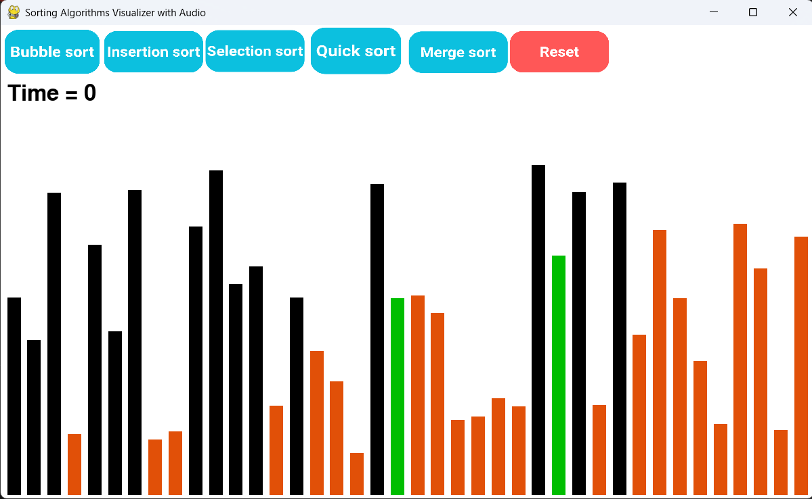
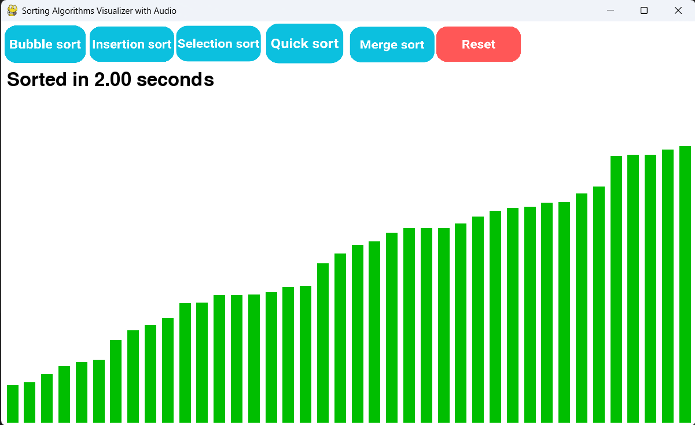

# Sorting Algorithms Visualizer with Audio

A Python-based interactive visualization tool that demonstrates various sorting algorithms with real-time visual feedback and audio cues. Watch as different sorting algorithms organize data in real-time with accompanying sound effects.

## Screenshots

### Initial State

*The application starts with 40 randomly generated bars ready to be sorted*

### Sorting in Progress

*Visual feedback during sorting with color-coded bars and real-time timer*

### Sorting Complete

*Completed sort showing all bars in green (correct position) with final time*

## Features

- **Visual Sorting**: Watch bars being sorted in real-time with color-coded feedback
- **Audio Feedback**: Each swap/move is accompanied by a sound effect
- **Multiple Algorithms**: Supports 5 different sorting algorithms:
  - Bubble Sort
  - Insertion Sort
  - Selection Sort
  - Quick Sort
  - Merge Sort
- **Interactive Interface**: Click buttons to select different sorting algorithms
- **Performance Timer**: Tracks and displays sorting time
- **Resizable Window**: Adjustable window size for better viewing
- **Color Coding**: 
  - Green: Elements in correct position
  - Orange/Red: Elements close to correct position
  - Black: Elements far from correct position

## Requirements

Install the required dependencies:

```bash
pip install -r requirements.txt
```

Or install pygame directly:

```bash
pip install pygame==2.6.1
```

## File Structure

```
.
├── main.py                                        # Main application file
├── sorting_functions.py                           # Sorting algorithm implementations
├── requirements.txt                               # Python dependencies
├── README.md                                      # Project documentation
├── mixkit-camera-shutter-click-1133.wav          # Sound effect file
├── Button images/                                 # Button image assets
│   ├── Bubble sort.png
│   ├── Insertion sort.png
│   ├── Selection sort.png
│   ├── Quick sort.png
│   ├── Merge sort.png
│   └── Reset.png
└── Screenshots/                                   # Application screenshots
    ├── Initial.png
    ├── In Progress.png
    └── Done.png
```

## How to Run

1. Ensure all image files and the sound file are in the same directory as the Python files
2. Run the main application:

```bash
python main.py
```

## How to Use

1. **Launch the application** - A window will open showing 40 randomly generated bars
2. **Select a sorting algorithm** - Click on any of the sorting algorithm buttons at the top
3. **Watch the visualization** - The bars will be sorted with visual and audio feedback
4. **Monitor performance** - The timer shows elapsed time during sorting and final completion time
5. **Reset** - Click the Reset button to generate new random data and try again

## Sorting Algorithms Implemented

### Bubble Sort
- **Time Complexity**: O(n²)
- **Description**: Repeatedly steps through the list, compares adjacent elements and swaps them if they're in the wrong order

### Insertion Sort
- **Time Complexity**: O(n²)
- **Description**: Builds the final sorted array one item at a time, inserting each element into its proper position

### Selection Sort
- **Time Complexity**: O(n²)
- **Description**: Finds the minimum element and places it at the beginning, then repeats for the remaining elements

### Quick Sort
- **Time Complexity**: O(n log n) average, O(n²) worst case
- **Description**: Divides the array around a pivot element and recursively sorts the sub-arrays

### Merge Sort
- **Time Complexity**: O(n log n)
- **Description**: Divides the array into halves, sorts them separately, then merges them back together

## Technical Details

- **Framework**: Pygame 2.6.1
- **Language**: Python 3
- **Window Size**: 1200x700 (resizable)
- **Data Size**: 40 random integers between 50-500
- **Frame Rate**: 60 FPS
- **Audio**: WAV format sound effects

## Controls

- **Sorting Buttons**: Click to start sorting with the selected algorithm
- **Reset Button**: Generates new random data and stops current sorting
- **Window Resize**: Drag window edges to resize (maintains aspect ratio)

## Customization

You can modify various parameters in the code:

- **Number of bars**: Change `number_of_bars` variable in [main.py](main.py)
- **Bar value range**: Modify the `random.randint(50, 500)` parameters
- **Sorting speed**: Adjust `time.sleep()` values in [sorting_functions.py](sorting_functions.py)
- **Sound volume**: Modify `pygame.mixer.music.set_volume()` value
- **Colors**: Change RGB values in the color conditions

## Educational Value

This visualizer helps understand:
- How different sorting algorithms work step-by-step
- Performance differences between algorithms
- The concept of algorithm complexity in practice
- Visual pattern recognition in sorting processes

## Future Enhancements

Potential improvements could include:
- Additional sorting algorithms (Heap Sort, Radix Sort, etc.)
- Speed control slider
- Step-by-step mode
- Algorithm comparison mode
- Export functionality for sorting performance data